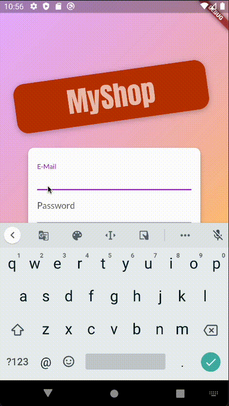
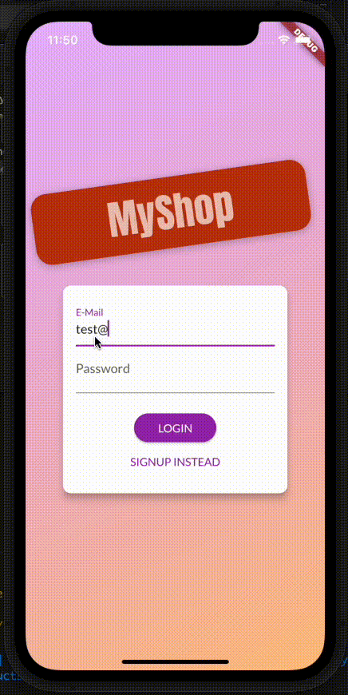

# Shop App Flutter

This application shows basic implementation of flutter features. This was based on [FLUTTER & DARK COMPLETE GUIDE COURSE - Maximilian Schwarzmüller](https://www.udemy.com/course/learn-flutter-dart-to-build-ios-android-apps/)

## Features
- Multiplattform support (iOS, Android, Web)
- API Calls
- SharePreferences
- Firebase - RTDB and Authentication
- Material UI (Cupertino is not applyed)
## Demo

|  Plattform |   |
|---|---|
|  web |   |
|  Android |   |
|  iOS |   |